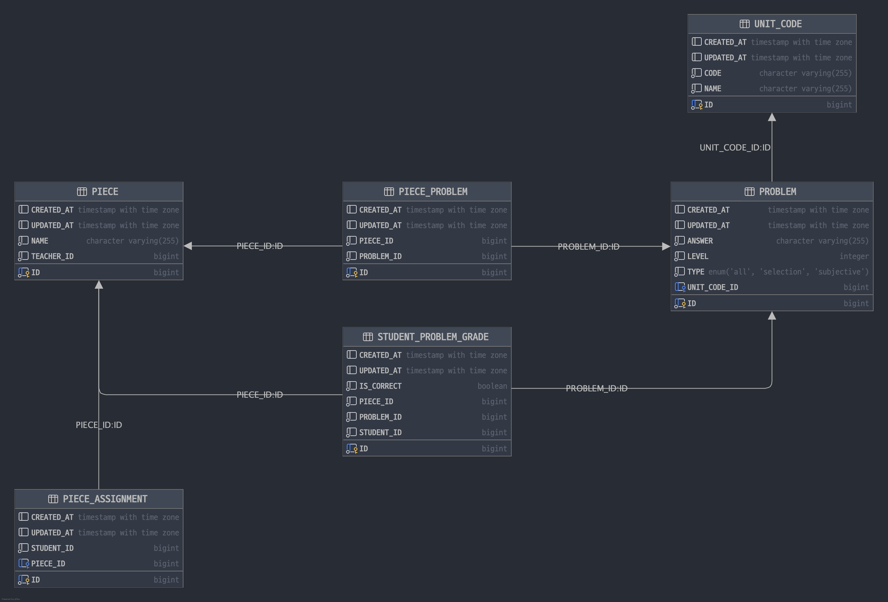

# 1. 개요
선생님과 학생 간의 학습지 관리 및 통계를 지원하는 학습 플랫폼 API입니다.

선생님은 학생들에게 문제를 출제하고, 학생들은 출제된 문제를 풀고 채점할 수 있습니다. 또한, 선생님은 학생들의 학습 통계 데이터를 통해 학습 성과를 분석할 수 있습니다.

## 2. 진행 상황
6개의 API는 모두 구현이 완료되었습니다.

하지만 테스트 코드가 아직 작성되지 않아, 안정성과 오류 방지에 대한 검증이 부족한 상태입니다. 향후 테스트 코드 작성이 필요합니다.

### 2-1. 구현한 API 목록
1. **문제 조회 API**: 선생님이 특정 조건을 바탕으로 문제를 조회합니다.
2. **학습지 생성 API**: 선생님이 조회한 문제들로 학습지를 생성합니다.
3. **학습지 출제 API**: 선생님이 생성한 학습지를 여러 학생에게 출제합니다.
4. **학습지 문제 조회 API**: 학생이 본인에게 출제된 학습지 문제를 확인합니다.
5. **문제 채점 API**: 학생이 풀었던 문제들을 채점합니다.
6. **학습지 학습 통계 분석 API**: 선생님이 특정 학습지에 대해 학생들의 학습 통계를 파악할 수 있습니다.

### 2-2. ERD

## 3. 발생 가능한 이슈 및 해결 방안

### 1. 테스트 코드 미작성
현재 테스트 코드가 작성되지 않아 서비스의 안정성과 오류 방지가 미흡합니다.
- **해결 방안**: 소형, 중형, 대형 테스트를 작성해야 합니다. 또한 CI/CD 테스트 자동화를 통해 새로운 변경이 기존 기능에 영향을 미치지 않도록 보장해야 합니다.

### 2. 데이터 일관성 이슈
학생이 학습지 문제를 푸는 도중에 학습지가 수정되거나 삭제될 경우, 데이터의 일관성이 깨질 위험이 있습니다.
- **해결 방안**: 학습지가 학생에게 출제된 후에는 학습지나 문제를 수정하거나 삭제하지 못하도록 제한을 두거나, 별도의 버전 관리 체계를 도입해 학생이 학습을 시작한 이후로는 데이터의 일관성을 유지합니다.

### 4. 성능 이슈
학습지 학습 통계 분석 API에서 많은 학생의 데이터를 조회하고 계산할 경우 성능 이슈가 발생할 수 있습니다.
- **해결 방안**: 통계 데이터를 미리 계산해 캐싱하거나, 배치 작업으로 미리 저장해두고 조회하는 방식으로 성능을 최적화할 수 있습니다.

### 5. Lazy Initialization 이슈
현재 `OSIV (Open Session in View)` 설정을 off 했기 때문에, 엔티티의 지연 로딩 필드가 view에서 참조될 경우 `LazyInitializationException`이 발생할 수 있습니다.
- **해결 방안**: 필요한 데이터는 서비스 레이어에서 모두 초기화한 상태로 반환하도록 하고, DTO를 적극적으로 활용해 데이터를 필요한 형태로 전달합니다.

### 6. 에러 처리 전략

#### 6-1. 전역 예외 처리
현재 전역 예외 처리를 위해 `@RestControllerAdvice`를 사용하여 `GlobalControllerAdvice` 클래스를 통해 예외를 핸들링하고 있습니다. 하지만 특정 예외 상황에 대한 핸들링이 아직 미흡한 상태입니다.
- **해결 방안**: `IllegalArgumentException`, `MethodArgumentNotValidException` 등 일반적인 예외뿐만 아니라, 세밀한 핸들링을 추가하여 클라이언트가 문제를 명확하게 이해할 수 있도록 합니다. 또한, 오류 원인을 쉽게 파악할 수 있도록 에러 메시지를 제공합니다.

#### 6-2. 커스텀 에러 응답 포맷
현재 모든 에러 응답은 동일한 형식의 `ApiResponse.error()`로 반환하고 있습니다. 그러나 상황에 따라 구체적인 오류 원인을 명시할 필요가 있습니다.
- **해결 방안**: 커스텀 에러 응답을 위한 공통 인터페이스를 정하고, 에러 코드를 포함하도록 개선하여 클라이언트 측에서 오류 상황을 더 잘 이해하고 처리할 수 있게 합니다. 예를 들어, 각 예외에 대해 고유한 에러 코드를 부여하고, 이를 통해 클라이언트가 프로그램적으로 오류를 핸들링할 수 있게 합니다.

## 4. 고민 거리 및 미완성 요소

### 1. **테스트 코드 작성 미비**
기능 구현을 우선하다 보니 테스트 코드 작성이 뒤처졌습니다.
### 2. **동적 쿼리 최적화**
QueryDSL을 사용하여 복잡한 동적 쿼리를 구현할 때마다 가독성, 최적화 등 늘 고민되고 신경쓰는 부분입니다.
### 3. **성능 최적화**
인기 선생님의 학습지인 경우 현재 구현된 통계 분석 API 성능 저하가 유발될 수 있습니다. 또한, 기타 조회 API에서도 db 인덱스 등을 통해 성능 최적화가 필요합니다.
### 4. **엔티티 연관 관계 설정**:
엔티티 간 연관 관계를 더 명확하게 정의하고 필요한 경우에만 연관을 설정하도록 개선합니다. 보통 Aggregate Root를 기준으로 연관 관계를 설정합니다.
예를 들어, 학습지와 문제 간의 다대다 관계를 풀어내기 위한 연결 테이블에서 어떤 경우에 연관 관계를 유지하고 어떤 경우에는 관계를 명시적으로 끊을지에 대해 고민 중입니다. 또한, 같이 조회되는 경우가 많은 엔티티들에 대해서 연관 관계를 설정할지에 대한 고민이 필요합니다.